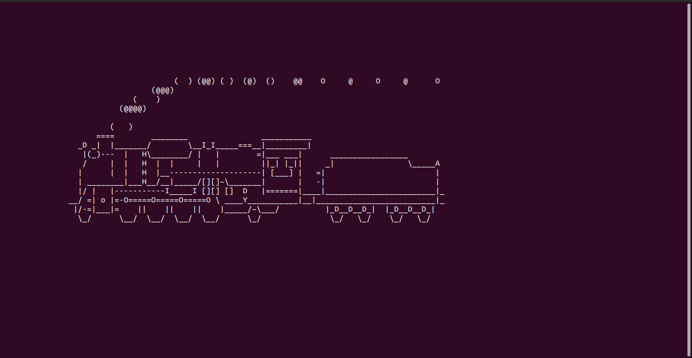
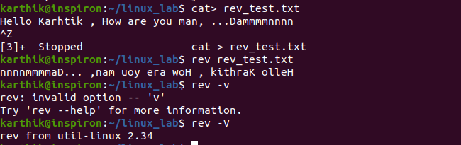
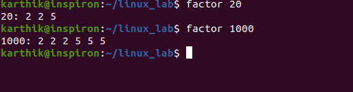
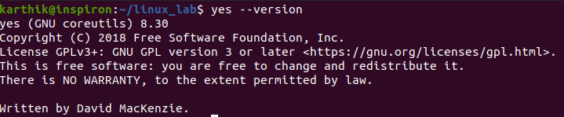
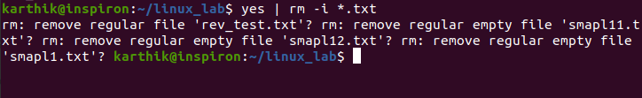
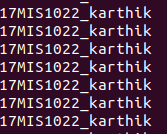
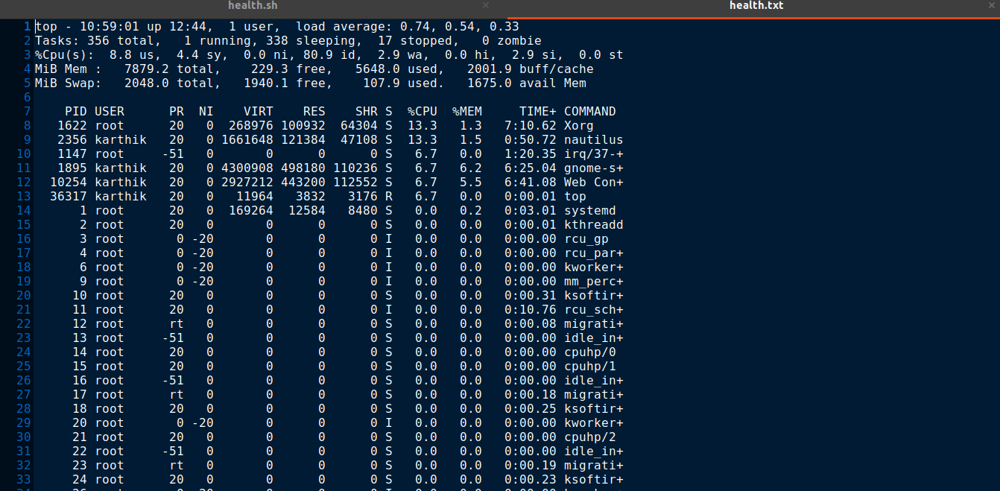
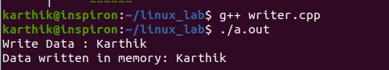
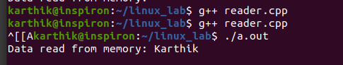

1)sl –funny train runs in terminal:

2) Rev Command in Linux:
Usage: Rev [text] or[filename]
rev -h ---Help
rev -V ---Version Number

3)Factor:The factor command in Linux is used to print the prime factors of the given numbers.

4)yes: yes command in linux is used to print a continuous output stream of given STRING. If STRING is not mentioned then it prints ‘y’

5)Instructions:
crontab -e --- to install the shell script for automation
Health monitor used in the scenario:
Top---process info
free---memory usage in the system
netstat---network info and socket connected info
vmstat—virtual mem and cache info

6) C program to implement Simple reader – writer algorithm using shared memory segment with semaphore

